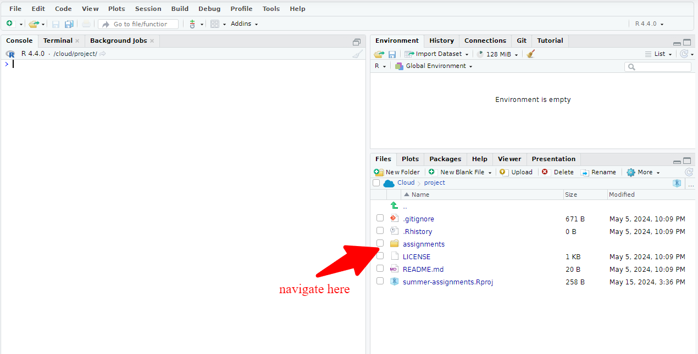

Summer Assignment Overview
================

<!-- README.md is generated from README.Rmd. Please edit that file -->

<figure>

<figcaption aria-hidden="true">Kennedy School Logo</figcaption>
</figure>

Welcome to the Summer 2024 Pre-Assignment! This readme file will provide
you with the basic structure of the folder in Posit Cloud and an
overview of what tools and resources we will be using.

## Getting Started

1.  **GitHub Account**: You will need a GitHub account to manage your
    projects and collaborate with others. If you haven’t created a
    GitHub account yet, please do so before starting the assignments.
    You can create an account at [GitHub](https://github.com/).
2.  **Access Assignments**: You can access the summer assignments using
    the following link: [Posit Cloud
    Assignments](https://posit.cloud/content/8155534).

## Folder Structure

In your Posit Cloud workspace, you will find the following folder
structure:

    /summer-assignment
      ├── assignments
          ├── R Summer Assignment 1.rmd
          ├── R Summer Assignment 2.rmd
          ├── R Summer Assignment 3.rmd
          ├── R Summer Assignment 4.rmd
          └── R Summer Assignment 5.rmd

### /assignments

This folder contains all the assignments you will need to complete
during the summer. Each assignment is provided as a RMarkdown (`.rmd`)
file. You will be working on these files directly in Posit Cloud.

<figure>

<figcaption aria-hidden="true">Folder Structure</figcaption>
</figure>

## Tools and Resources

### Posit Cloud

We will be using Posit Cloud as our primary platform for completing
assignments. Posit Cloud allows you to write, execute, and save R code
in a cloud environment, making it accessible from any device with an
internet connection.

### R and RStudio

R is the programming language we will be using for data analysis.
RStudio is an integrated development environment (IDE) for R that
provides a user-friendly interface for writing and running R code.

### GitHub

You will need a GitHub account to manage your projects and collaborate
with others. If you haven’t created a GitHub account yet, please do so
before starting the assignments.

### RMarkdown

RMarkdown is a powerful tool that combines Markdown and R code to create
dynamic, reproducible documents. You will be using it to write and
execute your R code within the assignments.

## Submission

Complete your assignments in the Posit Cloud environment. Please submit
only the `.rmd` file you are working on to the Assignment Page on
Canvas. We will announce when the Canvas site is created.

## Help and Support

If you get stuck or need assistance, please use Slack to ask the
teaching team.

Happy coding!
