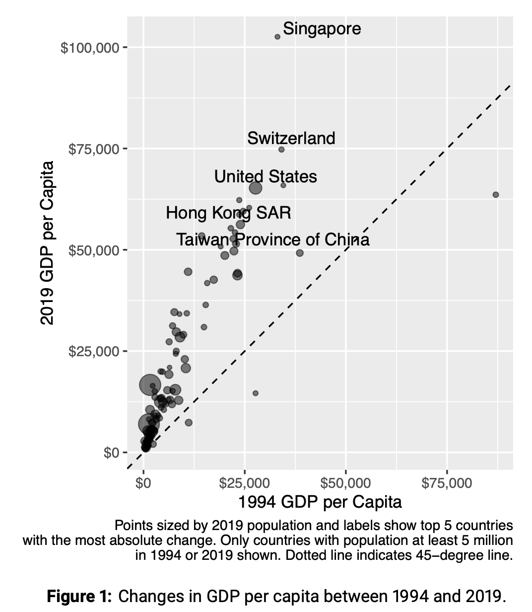

```{r setup, include=FALSE}
knitr::opts_chunk$set(echo = TRUE)
```


**Summer 2025, Pre-Assignment**

**Part 5: Capstone Assignment**

This set of exercises will help get you up and running with doing basic data
analysis in R. The goal of this capstone assignment is **not** that you will
have perfected R by the time you finish them, but that you have a solid
foundation of key concepts when going into Math Camp. During Math Camp, we will
go over much of this material in greater depth. Spending time on this now will
help make your future learning easier.

# ***Part I - Analysis of World Economic Outlook Data***

## **Problem 1: Sorting by Values**

The following questions are based on a recent version of the World Economic
Outlook (WEO) dataset published by the International Monetary Fund (IMF). Each
row in the spreadsheet is a country, with total GDP for a given year adjusted
for purchasing power parity (with the rgdp column prefix) and total population
(with the pop column prefix). GDP values are in millions of international
dollars, so you can directly compare values in different years. Population
values are in millions of persons.

To begin, run the code chunk below to open the dataset and the necessary
libraries.

```{r, warning=FALSE, message==FALSE}
# INSTALLATION CODE:

pkgs <- c("tidyverse", "ggrepel", "gapminder", "scales")

to_install <- which(!(pkgs %in% rownames(installed.packages())))

install.packages(pkgs[to_install])

# Open packages
library(tidyverse)
library(ggrepel)
library(scales)

# Open database
weo <- read_csv("https://www.dropbox.com/s/piuh2gsej1zpqq7/WEO-clean.csv?dl=1")

cat("Done!")
```

The command `head()` displays a preview of the dataset.

1.  Write a command (connected by pipes - `|>`) that:
2.  First sorts the dataset from lowest to highest real GDP in 2019, and then
3.  Select only the columns representing the country and its GDP. `select()` is
    a new `tidyverse` function that we have not covered yet. If you run
    `select()` after a `|>`, try listing the column names (separated by commas)
    that you would like to keep.

```{r}
# Write your code here!
```

2.  Write a command that is the same as (1) but now sort the dataset in
    descending order of 2019 GDP (highest to lowest).

```{r}
# Write your code here!
```

3.  The `arrange()` command can also sort more than one variable. To rank
    countries within their continent, write a command that sorts the countries
    by continent (in alphabetical order), then by 2019 GDP in descending order.
    Remember different inputs ("arguments") to a function are separated by
    commas.

```{r}
# Write your code here!
```

4.  Write a command that shows African countries in descending order of their
    2019 GDP (Use the variable continent to filter on African countries).

```{r}
# Write your code here!
```

## **Problem 2: GDP per capita**

Create a new tibble object called weo_percap that is the same as the main
dataset but also includes three new columns:

Operationalize the rate of growth between two periods a and b \> a (referring to
the formula below) as:

-   A variable called `gdp_percap_2019` that is the country's GDP per capita in
    2019,
-   A variable called `gdp_percap_1994`, which is the same as above but for
    1994, and
-   A variable called `growth_2019_1994` which indicates the rate of growth
    between the two variables above, following the definition below:

$growth_{b,a} = \frac{GDP per capita_b - GDP per capita_a}{GDP per capita_a}$

You will be using this new object for problem three.

```{r}
# Write your code here!
```

## **Problem 3: Graphing**

1.  Make a scatterplot that shows a country's 1994 GDP per capita on the x-axis
    and its 2019 GDP per capita on the y-axis.

You might notice that the scatterplot itself is not as informative as it could
be. In later sessions, we will spend time discussing the nuts and bolts of
making a high-quality graphic that is informative and user-friendly.

```{r}
# Write your code here!
```

2.  Show the same figure, but color the points by continent. That is, countries
    of the same continent should have the same color.

```{r}
# Write your code here!
```

3.  Show the same figure, but assign a different shape of point for different
    continents (hint: like `color`, there is a `shape` argument in `aes()`).
    Also, set the color for all countries to blue by using the color name
    `"blue"` (hint: since this will not change depending on values in the
    dataset, it does not need to go in `aes()`).

```{r}
# Write your code here!
```

4.  To make a figure presentable in a professional setting, you will need to
    make many, many more additions to a graph. At the very least, you need to
    label your axes with actual words. Update the graph in part (2) by adding an
    informative x-axis title and a y-axis title. This can be specified by adding
    a `labs()` layer to your graph. To see an example, open [the help page for
    the labs function](https://ggplot2.tidyverse.org/reference/labs.html), and
    scroll to the bottom of the page under "Examples".

```{r}
# Write your code here!
```

## **Problem 4: Mean and Median**

1.  Let's start to think about summarizing variables using summary statistics.
    Write code that reports the mean of country-level 2019 GDP per capita across
    all countries in one column and the median for 2019 in another. Pick column
    names that are sufficiently self- explanatory but also concise. What result
    do you get? Is this what you expected? Why might this be the case?

```{r}
# Write your code here!
```

2.  Write code that indicates which countries have missing values for 2019 GDP
    per capita. To do this, you could `filter()` with a value that tells you
    whether each value is NA or not. There is a function called `is.na()` that
    will return `TRUE` or `FALSE` if a value is missing. Think about how you
    might combine that with `filter()`. Try it out here.

```{r}
# Write your code here!
```

3.  We will now adjust for the missing values you received in part 1 of this
    question. By default, `mean()` and `median()` report a missing value if at
    least one of its input values is missing, and as you probably found in parts
    (1) and (2), a country has a missing value for 2019 GDP per capita. Now,
        modify your code so that you change this default and remove the missing
        values in your computation. [As the help page for the functions
        indicate](https://www.rdocumentation.org/packages/base/versions/3.6.2/topics/mean),
        the relevant argument is `na.rm`( for NA-remove). Set the logical value
        to `TRUE` (it is `FALSE` by default if you do not specify anything).

```{r}
# Write your code here!
```

## **Problem 5: Choose Your Own Adventure**

Take this opportunity to show off all that you have learned and using the World
Economic Outlook data set, pursue a question of your own that is of interest.
This could be done by producing summary statistics using the `group_by()`
command, producing a plot that you think is interesting, or anything else you
desire. It can be as simple or as complex as you'd like, as long as it is your
own!

Please write your question here:

WRITE QUESTION

And conduct your analysis below.

```{r}
# Write your code here!
```

Once you have completed, please write a brief paragraph, sharing your question,
a brief summary of the approach you do, and the key takeaway from your output
and post it on the course Slack. Take a chance to review others work and react!

## **[Challenge Problem] More Graphing**

This problem is more challenging. It involves some commands not covered in the
primers. Please attempt it to the best of your ability, but do not get
discouraged if you get stuck.

Make a graph like the one shown in the figure below based on the provided WEO
data set you used earlier. Follow both the graphical components of the graph
shown as you see them, as well as the description of the measures as described
in the Figure caption.

**Hint**: Check out the packages `ggrepel` and `scales` to implement some of the
features.



```{r}
# Write your code here!
```

## Your Feedback

Please submit an anonymous feedback form so we can understand what worked well
to support your learning experience and what did not. Your feedback will be
important to continue to improve this material for future MPA/IDs and to better
tailor our instruction during math camp and beyond. Please fill in the form
[here](https://harvard.az1.qualtrics.com/jfe/form/SV_2hqlUtSeD8ksNPE).

## Reminder to Submit

Please follow the submission instructions listed
[here](https://docs.google.com/document/d/195R1jrfbKN5lYZKT2BrU0cJB0Z1JftG8vSZ-60fdi0Q/edit?usp=sharing).
We suggest you submit your assignments as you finish them (i.e., don't wait
until you have completed them all to submit).

# ***Part II - Additional Optional Resources and Exercises***

We will continue to practice and develop R skills during the HKS Math Camp and
through-out the semester. We believe the above primers and exercises provide a
solid foundation in the skills needed for the semester, but if you have the time
and desire to hone your skills more before arriving on campus, we encourage you
to consult the following additional resources.

# Appendix

**Appendix 1: R for Data Science**

The free text [R for Data Science](https://r4ds.had.co.nz/index.html) is a
fantastic resource for learning different functions and applications and
provides more detail on these functions than the RStudio primers you completed.
We recommend you try exercises in the following chapters to test how comfortable
you are with the functions introduced in the primers.

1\. [Chapter 1 - Data Visualization](https://r4ds.hadley.nz/data-visualize.html)

2\. [Chapter 3 - Data
Transformation](https://r4ds.hadley.nz/data-transform.html)

**Appendix 2: Coursera: Data Analysis with R Programming**

This [course](https://www.coursera.org/learn/data-analysis-r) provides 37 hours
of additional introductory instruction to R. You do not need to do it all to get
value out of it. Focus on the parts that you want to learn more about.

**Appendix 3: Familiarize with the Style Guide**

Learning any language requires following its form and style. Throughout the
course, we will be enforcing style guidelines on how R code should be written.
To become familiar with these guidelines, read and try to internalize Book I
("Analyses") of [tidyverse style guide](https://style.tidyverse.org), especially
chapters 1 and 2.

**Appendix 4: R HKS cheat sheet**

To help you learn R in the most efficient way possible, we developed a cheat
sheet (available at [here](https://bit.ly/3V8Xfhn)) that provides you with the
default HKS way of doing certain common tasks in R. Feel free to deviate from
the cheat sheet, but we encourage you to adopt it when you are first learning R
as it will save you time from having to constantly conduct web searches to look
for commands to perform standard tasks in R.
